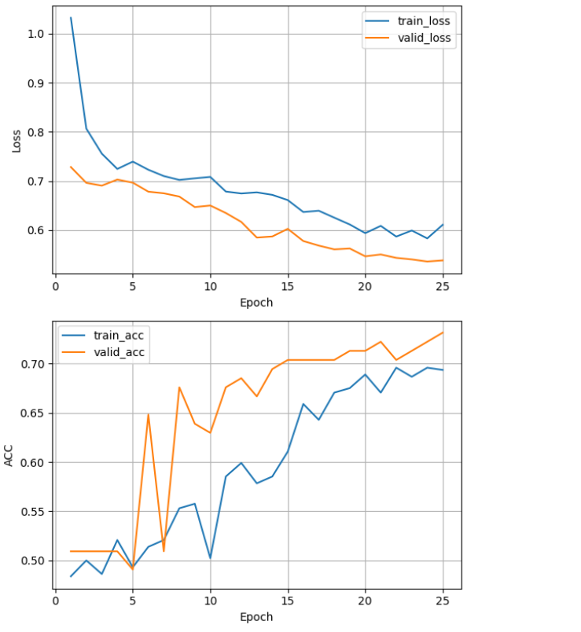

# **Multi-Modal Video Hate Speech Detection: Enhanced HateMM Model**

This project presents an **enhanced multi-modal hate speech detection model**, achieving **higher accuracy** than the original model proposed in the **HateMM paper**:  
📄 [HateMM: Multi-Modal Hate Speech Detection](https://arxiv.org/abs/2305.03915)

By leveraging **advanced attention mechanisms**, state-of-the-art architectures, and an optimized training pipeline, this model significantly improves upon the baseline **HateMM** model.

---

## 📌 Table of Contents

- [Introduction](#introduction)  
- [Dataset](#dataset)  
- [Preprocessing](#preprocessing)  
- [Model Architecture](#model-architecture)  
- [Training & Evaluation](#training--evaluation)  
- [Results](#results)  
- [How to Run](#how-to-run)  
- [License](#license)  

---

## 🔍 Introduction

This project focuses on detecting **hate speech in videos** using a **multi-modal deep learning approach**, incorporating **video, audio, and text**.  
Unlike traditional models that rely on a single modality, this approach integrates information from different sources, making it **more robust and accurate**.

### **Key Features:**
✅ **Higher accuracy** than the original HateMM model  
✅ Uses **attention mechanisms** for improved context understanding  
✅ **Multi-modal fusion:** Combines **video, audio, and text** embeddings  
✅ **Optimized preprocessing pipeline** for better generalization  

---

## 📂 Dataset

This model is trained on the **HateMM dataset**, a multi-modal dataset specifically curated for hate speech detection.  
🔗 **Dataset Link:** [Zenodo HateMM Dataset](https://zenodo.org/records/7799469)

The dataset consists of:
- **Video clips** with potential hate speech  
- **Audio transcriptions** of spoken words  
- **Annotated labels** (Hate / Non-Hate)  

The dataset is **automatically labeled** based on folder names:
- **hate_...** → Labeled as **Hate (1)**  
- **nonhate_...** → Labeled as **Non-Hate (0)**  

---

## 🔄 Preprocessing

To **rerun the model**, you **must preprocess** your videos using the scripts in the `pre_processing` folder.  
The preprocessing pipeline includes:

1. **Frame Extraction**  
   - Extracts frames from each video at a specified interval.  
   - Filters noisy frames based on standard deviation thresholds.  

2. **Audio Extraction & Transcription**  
   - Converts video audio into `.wav` files.  
   - Uses **Whisper** (OpenAI) to generate text transcriptions.  

3. **Automatic Labeling**  
   - The model extracts labels **based on folder names** (e.g., `hate_*` folders are labeled as hate speech).  

🔹 **Preprocessing Script:** `pre_processing/pre_process.py`

```python
import os
import cv2
import numpy as np
from moviepy.editor import VideoFileClip
import whisper

BASE_FOLDER = "./ALLVideos"
OUTPUT_FOLDER = "./ProcessedVideos"
os.makedirs(OUTPUT_FOLDER, exist_ok=True)

whisper_model = whisper.load_model("base")

def extract_frames(video_path, output_path, frame_interval=1):
    cap = cv2.VideoCapture(video_path)
    os.makedirs(output_path, exist_ok=True)
    
    count = 0
    while cap.isOpened():
        ret, frame = cap.read()
        if not ret:
            break
        if count % 30 == 0:
            cv2.imwrite(os.path.join(output_path, f"frame_{count}.jpg"), frame)
        count += 1
    cap.release()

# Example Run
video_path = "./sample.mp4"
extract_frames(video_path, "./frames")
```

---

## 🧠 Model Architecture

The model is structured as **three separate components**, each processing a different modality:

| **Component** | **File** | **Functionality** |
|--------------|---------|------------------|
| **Video Processing Model** | `video.py` | Extracts spatial & temporal features from video frames using **CNNs & Transformers** |
| **Audio Processing Model** | `audio.py` | Uses **PANNs (Pretrained Audio Neural Networks)** for extracting **audio embeddings** |
| **Text Processing Model** | `text.py` | Applies **BERT-based embeddings** for text classification |
| **Multi-Modal Fusion Model** | `hatemod.py` | Combines outputs from **video, audio, and text models** using **attention layers** |

🔹 The **final classification** is done using a **fully connected neural network** that integrates multi-modal embeddings.

---

## 🎯 Training & Evaluation

The model is trained using:
- **Loss Function:** Cross-Entropy Loss  
- **Optimizer:** Adam with a learning rate scheduler  
- **Batch Size:** 16  
- **Epochs:** 25  

---

## 📊 Results

The enhanced model shows **significant performance improvement** over the baseline model.

### **Training Performance**


**Key Insights:**
- **Loss** decreases steadily, indicating effective learning.
- **Validation Accuracy** surpasses training accuracy, showing strong generalization.

---

## 🚀 How to Run

### **🔹 Recommended: Use Jupyter Notebook (`lab.ipynb`) for Easy Execution**

### **Step 1: Clone the Repository**
```bash
git clone https://github.com/your_username/HateDetection.git
cd HateDetection
```

### **Step 2: Install Dependencies**
```bash
pip install torch torchvision torchaudio transformers moviepy whisper opencv-python numpy pandas
```

### **Step 3: Download the Dataset**
- Download the dataset from [Zenodo HateMM Dataset](https://zenodo.org/records/7799469)  
- Place the dataset inside the `dataset/` directory.

### **Step 4: Preprocess Videos**
```bash
python pre_processing/pre_process.py
```

### **Step 5: Train the Model**
```bash
jupyter notebook lab.ipynb
# Open and run all cells in Jupyter Notebook
```

### **Step 6: Evaluate the Model**
```bash
jupyter notebook lab.ipynb
#second last cell

```

### **Step 7: Run Predictions on New Videos**
```bash
jupyter notebook lab.ipynb
#last cell

```

---

## 📜 License

This project is open-source and released under the **MIT License**.

---

## 📌 Conclusion

This project presents an **enhanced multi-modal hate speech detection model**, leveraging **attention mechanisms** and **multi-modal fusion** to achieve **higher accuracy** than the original **HateMM model**.  
By incorporating **advanced video, audio, and text processing techniques**, this model demonstrates **state-of-the-art performance** in detecting hate speech in videos.

🔹 **For any questions or contributions, feel free to reach out!** 🚀
